# 单因子回测流程图

```mermaid
flowchart TB
    %% ==================== 样式定义 ====================
    classDef dataFile fill:#1a1a2e,stroke:#16213e,color:#e0e0e0
    classDef process fill:#0f3460,stroke:#16213e,color:#e0e0e0
    classDef filter fill:#533483,stroke:#3b2770,color:#e0e0e0
    classDef analysis fill:#1a3a3a,stroke:#0f2f2f,color:#e0e0e0
    classDef metrics fill:#4a2e1e,stroke:#3a1e0e,color:#e0e0e0
    classDef output fill:#2e1e4a,stroke:#1e0e3a,color:#e0e0e0
    classDef decision fill:#5c3d2e,stroke:#3d2e1e,color:#e0e0e0

    %% ==================== 数据加载 ====================
    subgraph S1["📁 第一步：数据加载"]
        direction LR
        A1["📦 price_data.parquet<br/>577万行 × 13列<br/>MultiIndex: [trade_date, code]<br/>──────────────<br/>is_st · trade_days<br/>open/high/low/close<br/>vol · amount · pct_chg<br/>open_adj · high_adj<br/>low_adj · close_adj"]:::dataFile
        A2["📦 fct_df.parquet<br/>566万行 × 2列<br/>MultiIndex: [trade_date, code]<br/>──────────────<br/>fct_1 · fct_2"]:::dataFile
    end

    %% ==================== 数据合并 ====================
    subgraph S2["🔗 第二步：数据合并"]
        B1["pd.concat(axis=1, join='inner')<br/>按 MultiIndex [trade_date, code] 水平拼接<br/>取交集：仅保留两个文件共有的行<br/>──────────────<br/>合并后: 566万行 × 15列"]:::process
    end

    %% ==================== 因子预处理 ====================
    subgraph S3["🔧 第三步：因子预处理"]
        direction TB
        C1["extreme_MAD()<br/>──────<br/>稳健缩尾去极值<br/>上下界 = 中位数 ± 5.2×MAD<br/>低于下界→截断为下界<br/>高于上界→截断为上界"]:::process
        C2["standardize_z() + fillna(0)<br/>──────<br/>Z-Score 标准化<br/>(x − mean) / std<br/>缺失值填充为 0（均值水平）"]:::process
        C1 --> C2
    end

    %% ==================== 样本池过滤 ====================
    subgraph S4["🔍 第四步：样本池过滤 (preprocess_data)"]
        direction TB
        D1{"is_st == False ?<br/>──────<br/>剔除 ST 股票<br/>（约 17.7万行，占 3%）"}:::filter
        D2{"trade_days ≥ 365 ?<br/>──────<br/>剔除上市不足一年<br/>（约 34万行，占 6%）"}:::filter
        D3["删除 is_st 和 trade_days 列<br/>──────<br/>精简数据，后续不再使用"]:::filter
        D1 -->|✅ 是| D2
        D1 -->|❌ 否 ST| D_OUT["🚫 丢弃"]
        D2 -->|✅ 是| D3
        D2 -->|❌ 否 次新股| D_OUT
    end

    %% ==================== 因子回测核心 ====================
    subgraph S5["⚙️ 第五步：因子分层回测 (factor_analysis)"]
        direction TB
        E1["构建 close_adj 透视表<br/>──────<br/>pivot_table(index='trade_date',<br/>columns='code', values='close_adj')<br/>变为 trade_date × code 二维矩阵"]:::process

        E2["对每个持有期 period ∈ {1, 5, 10, 20}<br/>循环执行以下步骤"]:::process

        subgraph S5_LOOP["单期回测循环"]
            direction TB
            E3["计算未来收益率<br/>──────<br/>future = close_adj.shift(-period-1)  → 卖出价<br/>current = close_adj.shift(-1)          → 买入价<br/>收益率 = future / current − 1"]:::process
            E4["避免样本重叠<br/>──────<br/>iloc[::period] 每隔 period 行取一日期<br/>使收益序列独立同分布<br/>便于 ICIR 统计推断"]:::process
            E5["因子-收益对齐<br/>──────<br/>pd.merge(factor_df, returns_series)<br/>按 (trade_date, code) 合并<br/>得到: 日期 · 代码 · 因子值 · 未来收益"]:::process
            E6["每日截面分层<br/>──────<br/>pd.qcut(x, 10, duplicates='drop')<br/>每天按因子值分 10 组<br/>Q1(最低) ~ Q10(最高)<br/>加入 quantile 列标记所属分组"]:::process
            E3 --> E4 --> E5 --> E6
        end

        E2 --> E3
    end

    %% ==================== 绩效分析 ====================
    subgraph S6["📊 第六步：绩效分析 (analyze_factor_performance)"]
        direction TB
        F1["计算分位数日收益率<br/>──────<br/>groupby(date, quantile).mean()<br/>透视表: trade_date × quantile"]:::analysis
        F2["计算分位数累计收益<br/>──────<br/>(1+r).cumprod() − 1<br/>取最后一行 = 全期累计收益率"]:::analysis
        F3["计算多空组合收益<br/>──────<br/>Q10 累计收益 − Q1 累计收益"]:::analysis
        F4["计算 IC 时间序列<br/>──────<br/>每日 Spearman 秩相关系数<br/>corr(因子值, 未来收益)<br/>样本 ≤5 则丢弃该日"]:::analysis
        F5["计算 ICIR<br/>──────<br/>IC 均值 / IC 标准差<br/>衡量因子预测稳定性"]:::analysis
        F1 --> F2
        F2 --> F3
        F1 --> F4
        F4 --> F5
    end

    %% ==================== 方向判断 ====================
    subgraph S7["🧭 第七步：因子方向判断 (determine_factor_direction)"]
        direction TB
        G1{"多空收益 > 0 ?"}:::decision
        G2["✅ 正向因子<br/>因子值越大 → 收益越高<br/>目标分组: Top组 Q10"]:::analysis
        G3["🔄 负向因子<br/>因子值越小 → 收益越高<br/>目标分组: Bottom组 Q1"]:::analysis
        G1 -->|是| G2
        G1 -->|否| G3
    end

    %% ==================== 组合指标 ====================
    subgraph S8["📈 第八步：组合绩效指标 (calculate_portfolio_metrics)"]
        direction TB
        H1["对目标分位组（正向→Q10 / 负向→Q1）的日收益率序列<br/>计算以下指标"]:::metrics
        H2["累计收益率<br/>∏(1+r) − 1"]:::metrics
        H3["年化收益率<br/>(1+R)^(252/n) − 1"]:::metrics
        H4["最大回撤<br/>max(1 − 净值/历史最高)"]:::metrics
        H5["夏普比率<br/>年化收益 / 年化波动率"]:::metrics
        H6["索提诺比率<br/>年化收益 / 下行波动率"]:::metrics
        H7["卡玛比率<br/>年化收益 / 最大回撤"]:::metrics
        H1 --> H2 & H3 & H4 & H5 & H6 & H7
    end

    %% ==================== 输出 ====================
    subgraph S9["📤 第九步：结果输出"]
        direction LR
        I1["📊 Excel 输出<br/>──────<br/>Sheet1: 汇总统计<br/>IC · ICIR · 收益 · 回撤 · 夏普<br/>──────<br/>Sheet2: 分位数收益<br/>Q1~Q10 各期累计收益<br/>──────<br/>Sheet3: IC时间序列<br/>每日IC值"]:::output
        I2["🎨 可视化图表<br/>──────<br/>图1: 分层累计收益曲线<br/>Q1~Q10 各组的净值走势<br/>Q1(蓝) Q10(红) 突出显示<br/>──────<br/>图2: 因子绩效仪表盘<br/>多空收益柱状图<br/>IC柱状图<br/>分位收益线图<br/>IC时间序列图"]:::output
    end

    %% ==================== 主流程连线 ====================
    S1 --> S2
    S2 --> S3
    S3 --> S4
    S4 --> S5
    S5 --> S6
    S6 --> S7
    S7 --> S8
    S8 --> S9

    %% ==================== 图例 ====================
    subgraph LEG["图例"]
        L1["📦 数据文件"]:::dataFile
        L2["🔧 数据处理"]:::process
        L3["🔍 过滤筛选"]:::filter
        L4["⚙️ 回测分析"]:::analysis
        L5["📈 绩效指标"]:::metrics
        L6["📤 结果输出"]:::output
    end
```

> 本文含两张图：**原版**（`fct_backtest注释版.py`，9 步完整流程）与 **改进版**（`fct_backtest改进版.py`，含每日截面预处理 / 日历化调仓 / FM回归+Newey-West / 市值行业中性化）。

## 一、原版流程

---

## 二、改进版流程（`fct_backtest改进版.py`）

> 红色步骤为相对原版的**新增/修改**之处；其余步骤与原版一致。

```mermaid
flowchart TB
    %% ==================== 样式定义 ====================
    classDef dataFile fill:#1a1a2e,stroke:#16213e,color:#e0e0e0
    classDef process fill:#0f3460,stroke:#16213e,color:#e0e0e0
    classDef newStep fill:#4d0000,stroke:#3a0000,color:#ffd6d6
    classDef analysis fill:#1a3a3a,stroke:#0f2f2f,color:#e0e0e0
    classDef metrics fill:#4a2e1e,stroke:#3a1e0e,color:#e0e0e0
    classDef output fill:#2e1e4a,stroke:#1e0e3a,color:#e0e0e0

    %% ==================== 数据加载 ====================
    subgraph I1["📁 第一步：数据加载（含风格数据）"]
        direction LR
        A1["📦 price_data.parquet<br/>577万行 × 15列<br/>MultiIndex: [trade_date, code]<br/>──────────────<br/>行情 13 列 + <b>mkt_cap 市值</b><br/>+ <b>industry 申万一级行业</b>"]:::dataFile
        A2["📦 fct_df.parquet<br/>566万行 × 2列<br/>fct_1 · fct_2"]:::dataFile
    end

    %% ==================== 合并 ====================
    subgraph I2["🔗 第二步：数据合并"]
        B1["pd.concat(axis=1, join='inner')<br/>合并后: 566万行 × 17列<br/>（含市值/行业，供中性化使用）"]:::process
    end

    %% ==================== 样本池过滤 ====================
    subgraph I3["🔍 第三步：样本池过滤 preprocess_data"]
        D1{"is_st == False ?"}:::process
        D2{"trade_days ≥ 365 ?"}:::process
        D3["删除 is_st 和 trade_days 列"]:::process
        D1 -->|✅| D2
        D1 -->|❌ ST| OUT["🚫 丢弃"]
        D2 -->|✅| D3
        D2 -->|❌ 次新股| OUT
    end

    %% ==================== 每日截面预处理 ====================
    subgraph I4["🔧 第四步：每日截面预处理 preprocess_factors （🔴 修复问题一）"]
        direction TB
        C1["extreme_MAD() 按日截面<br/>groupby(level='trade_date').transform()<br/>每日中位数 median ± 5.2×MAD 缩尾<br/>统计量只用当日股票 → 无前视"]:::newStep
        C2["standardize_z() 按日截面<br/>每日 (x − mean) / std → 均值为 0<br/>缺失填 0（=截面均值水平）"]:::newStep
        C1 --> C2
    end

    %% ==================== 日历化调仓 + 窗口收益 ====================
    subgraph I5["⚙️ 第五步：日历化调仓 factor_analysis （🔴 修复问题二）"]
        direction TB
        E1["build_rebalance_dates()<br/>auto(隔period日) / daily<br/>weekly(周末) / monthly(月末)"]:::newStep
        E2["窗口锚定收益<br/>调仓日T因子已知 → T+1收盘买入<br/>→ 下卖出调仓日次日收盘卖出<br/>monthly = 月末因子 → 下月收益"]:::newStep
        E3["因子-收益对齐（携带市值/行业）<br/>pd.merge 按 (trade_date, code)"]:::process
        E4["每日截面分层 qcut → Q1~Q10"]:::process
        E1 --> E2 --> E3 --> E4
    end

    %% ==================== FM回归 + NW ====================
    subgraph I6["📊 第六步：统计检验 （🔴 修复问题三）"]
        direction TB
        F1["fama_macbeth_regression()<br/>逐调仓日截面 OLS<br/>ret ~ factor → 平均斜率(BP)"]:::newStep
        F2["newey_west_se()<br/>Bartlett 权重 HAC 修正<br/>lags = floor(4·(n/100)^(2/9))"]:::newStep
        F3["输出 IC_t_NW / 多空_t_NW / FM_t_NW<br/>修正自相关 → 消除 t 值虚高"]:::newStep
        F1 --> F2 --> F3
    end

    %% ==================== 中性化 ====================
    subgraph I7["🧹 第七步：市值+行业中性化 （🔴 修复问题四）"]
        direction TB
        G1["neutralize_factor()<br/>factor ~ log(mkt_cap) + 行业哑变量<br/>逐日截面回归取残差"]:::newStep
        G2["中性化因子 = 残差（Barra 风格剥离）<br/>分层 / IC / FM 均基于中性化因子"]:::newStep
        G3["诊断: 因子 vs log(市值) 日均秩相关<br/>判断是否为「小市值马甲」"]:::newStep
        G1 --> G2 --> G3
    end

    %% ==================== 方向/组合/输出 ====================
    subgraph I8["📈 第八步：方向判断 + 组合指标"]
        H1["determine_factor_direction()<br/>按有效因子（中性化或原始）<br/>多空收益定正/负向"]:::analysis
        H2["calculate_portfolio_metrics()<br/>年化口径按月/周/日折算<br/>(monthly=21 · weekly=5 · 其余=period)"]:::analysis
        H1 --> H2
    end

    subgraph I9["📤 第九步：结果输出"]
        I1o["📊 Excel 5 Sheet<br/>汇总统计 · 分位数收益<br/>IC时间序列<br/>FM回归与NW检验 · 中性化诊断"]:::output
        I2o["🎨 图表<br/>分层收益曲线（标注调仓方式）<br/>绩效仪表盘 2×2"]:::output
    end

    I1 --> I2
    I2 --> I3
    I3 --> I4
    I4 --> I5
    I5 --> I6
    I6 --> I7
    I7 --> I8
    I8 --> I9
```

